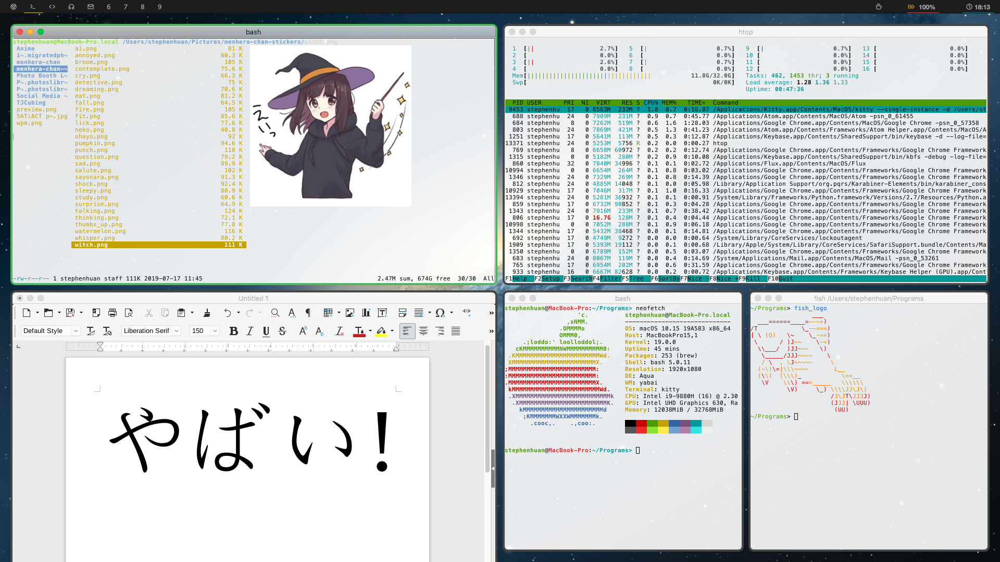

# dotfiles




[[Yabai Demonstration Video]](https://www.youtube.com/watch?v=AdwhjIg_Xe4)

Collection of configuration files ("dotfiles") primarily meant for
yabai configuration on MacOS (although the CLIs are generally pretty
OS-agnostic). I would, however recommend moving away from MacOS.

Their [track record](https://sneak.berlin/20201112/your-computer-isnt-yours/)
with respect to security, privacy, and respecting user's freedoms in general
isn't the best. As the M1 Macs are replacing Intel CPUs, Apple is increasingly
restricting the ability for one to use one's own computer as one wishes.

Instead, I would recommend a Linux distribution like
[archlinux](https://www.archlinux.org/), [debian](https://debian.org/),
or [gentoo](https://www.gentoo.org/). It's a bit of a pain to
setup any Linux distribution on Macbooks but the folks at [t2linux
wiki](https://wiki.t2linux.org/) have done great work towards this front. It's
also possible to buy hardware explicitly designed for Linux compatibility
from companies like [tuxedo computers](https://www.tuxedocomputers.com/en)
and [system76](https://system76.com/).

Files are managed with [yadm](https://yadm.io/),
see [dotfiles.md](./doc/dotfiles.md) for
other dotfile systems and how to use `yadm`.

Quickstart:
```shell
cd ~
# make sure yadm is installed
yay -S yadm-git
yadm clone https://github.com/stephen-huan/dotfiles
# if yadm does not prompt automatically
yadm bootstrap
yadm status
```

## Configuration

- Desktop environment
    - [yabai](./doc/yabai.md), tiling window manager
    - [spacebar](./doc/spacebar.md), top bar with icons
- Keyboard shortcuts
    - [karabiner](./doc/karabiner.md),
kernel extension for input device manipulation (keyboard, mouse)
    - [skhd](./doc/skhd.md), hotkey manipulation, works well with Yabai
- Command line interfaces (terminal programs)
    - [kitty](./doc/kitty.md), terminal emulator
    - [fish](./doc/fish.md), shell
    - [ranger](./doc/ranger.md), file manager
    - [tmux](./doc/tmux.md), terminal multiplexer
    - [vim](./doc/vim.md), text editor
    - [cmus](./doc/cmus.md), music player
    - [mutt](./doc/mutt.md), mail user agent
- DNS/internet
    - [stubby](./doc/stubby.md), stubby (i.e. non-recursive) DNS resolver
    - [unbound](./doc/unbound.md), general DNS resolver with caching

[MacOS-specific tips](./doc/macos.md)

