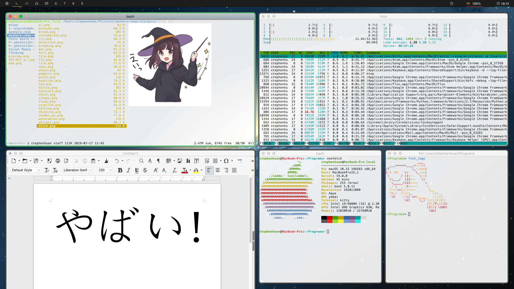
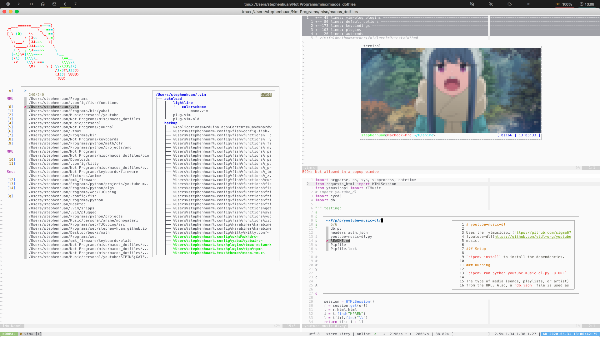

# dotfiles 




Collection of configuration files ("dotfiles") primarily meant for yabai
configuration on MacOS (although the CLIs are generally pretty OS-agnostic).
I would, however recommend moving away from MacOS.
Their [track record](https://sneak.berlin/20201112/your-computer-isnt-yours/)
isn't the best and I (should) use
[arch](https://gist.github.com/stephen-huan/dfec407ea31707f1ef43c1c7e1d10733)
btw (it's a huge pain to setup on Macbooks).

[[Yabai Demonstration Video]](https://www.youtube.com/watch?v=AdwhjIg_Xe4)

Files are managed with [rcm](https://github.com/thoughtbot/rcm), see 
[dotfiles](./doc/meta.md) for other solutions and how to use rcm. 

Quickstart:
```bash
cd ~
git clone https://github.com/stephen-huan/dotfiles 
# make sure rcm is installed 
rcup -d "~/dotfiles/.dotfiles" -v
```

## Configuration

- Desktop environment
    - [yabai](./doc/yabai.md), tiling window manager
    - [spacebar](./doc/spacebar.md), top bar with icons
- Keyboard shortcuts
    - [karabiner](./doc/karabiner.md),
kernel extension for input device manipulation (keyboard, mouse)
    - [skhd](./doc/skhd.md), hotkey manipulation, works well with Yabai 
- Command line interfaces (terminal programs)
    - [kitty](./doc/kitty.md), terminal emulator
    - [fish](./doc/fish.md), shell
    - [ranger](./doc/ranger.md), file manager
    - [tmux](./doc/tmux.md), terminal multiplexer
    - [vim](./doc/vim.md), text editor
    - [cmus](./doc/cmus.md), music player
    - [mutt](./doc/mutt.md), mail user agent
- DNS/internet
    - [stubby](./doc/stubby.md), stubby (i.e. non-recursive) DNS resolver 
    - [unbound](./doc/unbound.md), general DNS resolver with caching

[MacOS-specific tips](./doc/macos.md)

